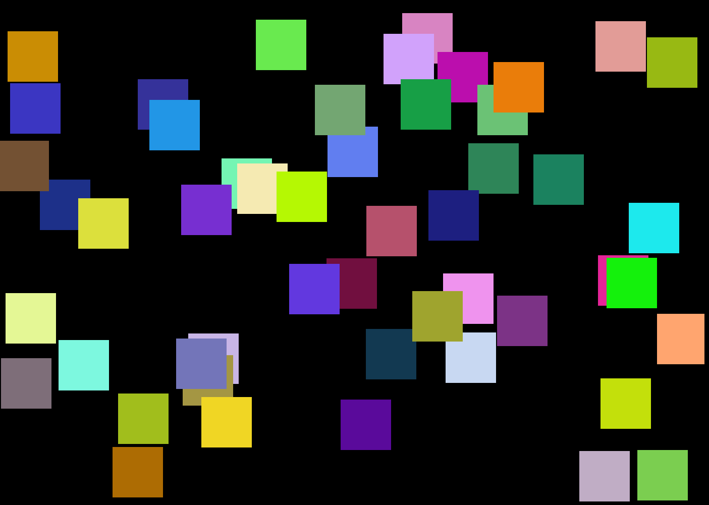
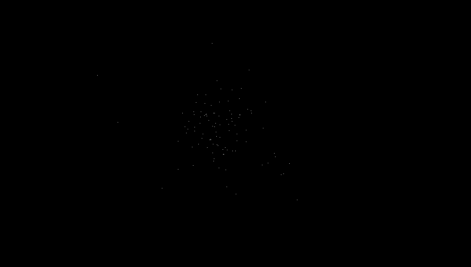

# python_graphics
opengl with python???

The purpose of this project is threefold:
1) Do more graphics
2) Learn more about OpenGL, GLFW, GLUT
3) Learn more about the graphics pipeline and build a framework for 2D (3D maybe later?) rendering

Requires PyOpenGL, GLFW

Scene 1 renders 50 squares in random positions and gives them a random velocity vector. The squares collide with the borders of the window and velocity is updated accordingly.

(You may need to open this image at full resolution to see the points!)

Scene 3 renders 1000 points in random positions and gives them a random velocity vector. They collide with the window borders and also accelerate due to gravity.

(You may need to open this image at full resolution to see the points!)

Scene 4 renders 100 points in random positions within a small area of the window. Each frame, the acceleration due to gravity between the points is calculated and the velocity vectors of each point are updated accordingly. The small number of points is indicative of the need to utilize the GPU, which will likely be the next phase of this project.
