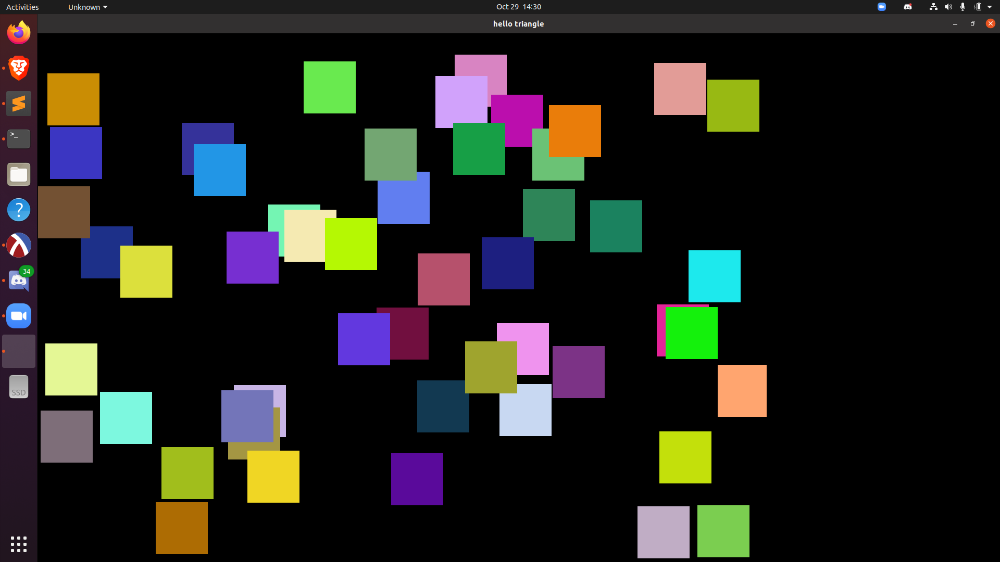

# python_graphics
opengl with python???

The purpose of this project is threefold:
1) Do more graphics
2) Learn more about OpenGL, GLFW, GLUT
3) Learn more about the graphics pipeline and build a framework for 2D (3D maybe later?) rendering

Requires PyOpenGL

Currently renders 50 squares in random positions and gives them a random velocity vector. The squares collide with the borders of the window and velocity is updated accordingly.
